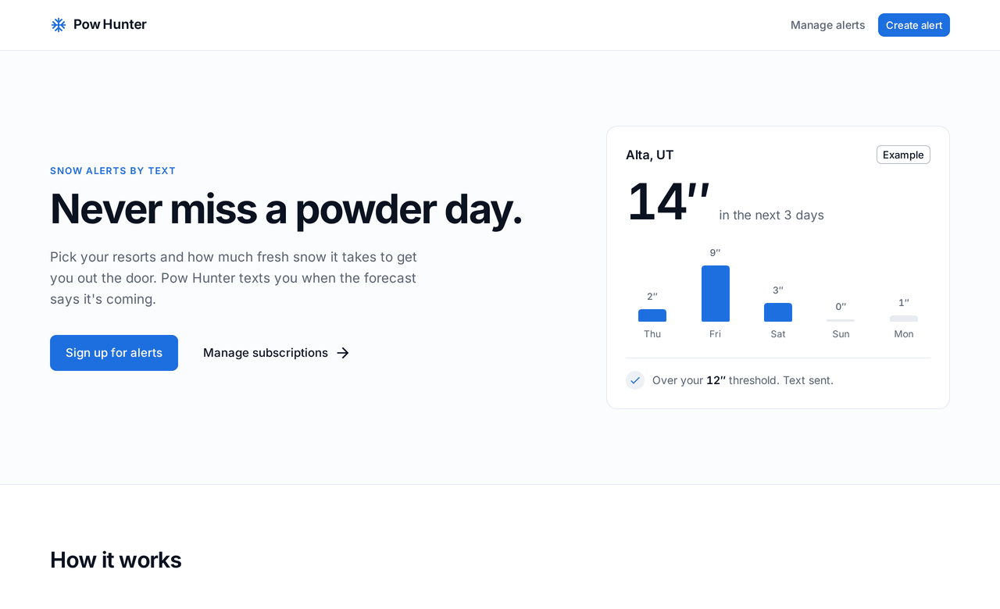

<div align="center">

# ❄ Pow Hunter

**Never miss a powder day.**
Pick your resorts and the snowfall worth chasing. Pow Hunter texts you when the forecast delivers.

[](https://github.com/MattSilvaa/powhunter/actions/workflows/test.yml)
[](https://github.com/MattSilvaa/powhunter/actions/workflows/codeql.yml)


[](LICENSE)



</div>

## How it works

1. **Pick your resorts.** Follow as many mountains as you like.
2. **Set your number.** Choose a minimum snowfall from 1″ to 24″, and up to 10 days of notice.
3. **Get a text.** A scheduled forecaster checks [Weather.gov](https://www.weather.gov/documentation/services-web-api) for every resort and sends an SMS through Twilio when a forecast meets your number. Each alert is sent once.

Sign-in is passwordless: request a link by email, click it, and manage your alerts.

## Architecture

```
client/  React SPA ──▶ server/cmd/api        Go HTTP API ──▶ PostgreSQL
                       server/cmd/forecaster  scheduled job: Weather.gov ─▶ Twilio SMS
```

| Layer | Stack |
| --- | --- |
| **Web** | React 19, React Router 7, MUI 7, TanStack Query, Bun |
| **API** | Go 1.24, `net/http`, sqlc, goose migrations |
| **Data** | PostgreSQL 17 |
| **Services** | Weather.gov (forecasts), Twilio (SMS), Resend (email) |
| **Ops** | Render, Caddy, Prometheus, Grafana, Alertmanager |

## Quick start

You need **Go 1.24+**, **Bun**, and **Docker** (for the local Postgres).

```bash
make install      # Go modules, client packages, sqlc and goose
make db-setup     # start Postgres in Docker and create the database
make db-migrate   # apply migrations and load the resort list
make dev          # API on :8080, web app on :5173
```

Local development needs no extra configuration. Without `RESEND_API_KEY`, emails (including sign-in links) are printed to the server log instead of being sent. The forecaster needs Twilio credentials to run.

Every setting is documented in [`server/.env.example`](server/.env.example).

## Commands

| Command | What it does |
| --- | --- |
| `make dev` | Run the API and the web app with live reload |
| `make test` | Server and client unit tests |
| `make test-integration` | Server integration tests (needs the test database) |
| `make lint` / `make typecheck` | golangci-lint, ESLint and TypeScript checks |
| `make build` | Production client build and server binaries |
| `make start-forecaster` | Run one forecast check |
| `make generate-db-code` | Regenerate the sqlc query code |
| `make monitoring-up` | Start Prometheus, Grafana and Alertmanager locally |

## Project layout

```
client/            React app (see client/STYLEGUIDE.md for UI conventions)
server/cmd/        api, forecaster, migrate and seed entrypoints
server/internal/   handlers, auth, forecast, weather, notify, db, metrics
server/monitoring/ Prometheus, Alertmanager and Grafana config
```

## Docs

- [Forecast pipeline](server/FORECAST.md)
- [Testing](server/TESTING.md)
- [Monitoring](server/monitoring/README.md)
- [Frontend style guide](client/STYLEGUIDE.md)

## License

[MIT](LICENSE)
